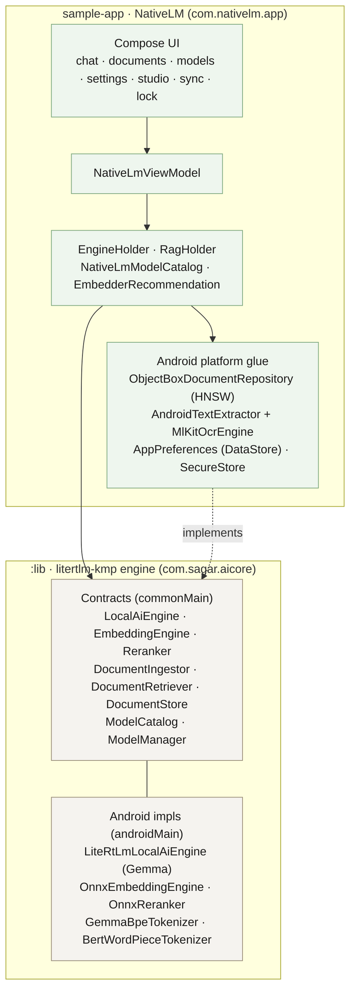
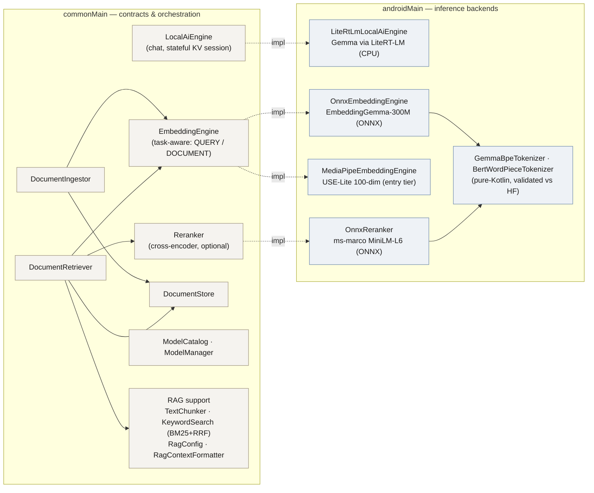
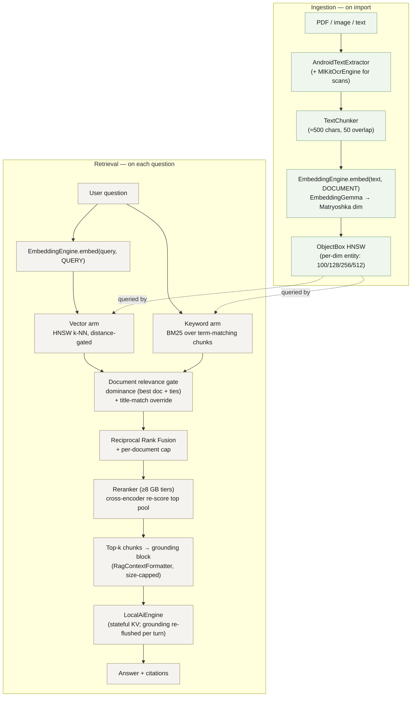
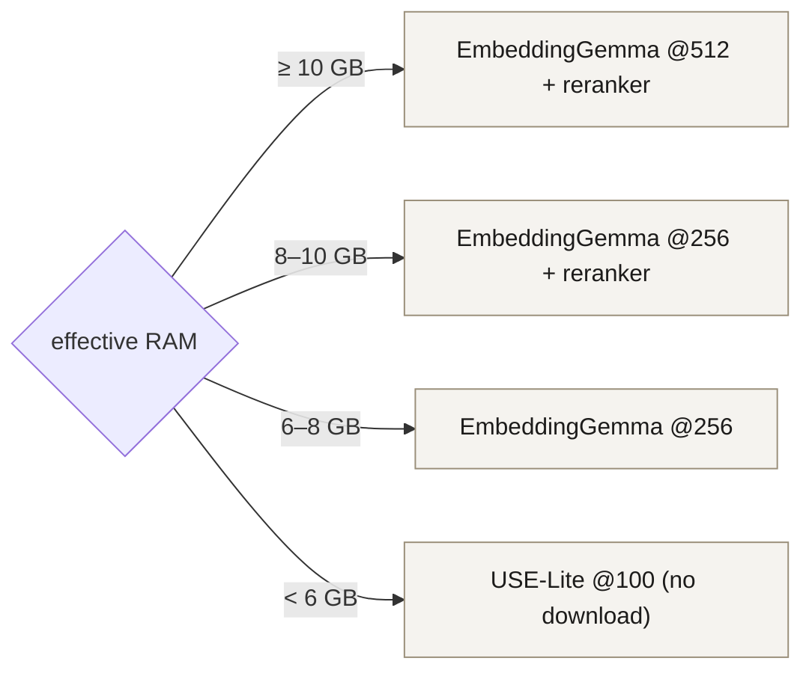

# Architecture

NativeLM is an on-device document-chat app built on **litertlm-kmp**, a Kotlin
Multiplatform engine that wraps Google's LiteRT-LM. Everything — the language model,
the embedder, the vector index, OCR, speech-to-text — runs locally. No account, no
upload, no telemetry. This document explains how the pieces fit together, the design
decisions behind the engine/product separation, and the platform-specific gotchas the
library handles for you.

Two Gradle modules:

- **`:lib`** — the engine (`com.sagar.aicore`), published as `com.sagar:litertlm-kmp`.
  Dual-licensed (AGPL-3.0 / commercial). Kotlin Multiplatform: `commonMain` holds
  platform-neutral contracts and orchestration; `androidMain` holds the Android-backed
  inference; `iosMain` carries the iOS roadmap surface; `commonTest` the unit tests.
- **`:sample-app`** — the NativeLM product (`com.nativelm.app`). Android + Compose. It
  supplies the platform-backed stores (ObjectBox, DataStore, SAF, ML Kit OCR) and the
  user experience, and depends on `:lib` — never the other way around.



The key architectural rule: **the product talks to the engine only through contracts**.
The product *provides* storage implementations (e.g. `ObjectBoxDocumentRepository`
implements the engine's `DocumentStore`) but never reaches into engine internals. That
inversion is what lets the same engine power a second app (a kids' learning app, Curio)
through a Gradle composite build.

## Module layout

```
litertlm-kmp/
├── lib/                       ← the engine; published artifact com.sagar:litertlm-kmp
│   └── src/
│       ├── commonMain/        ← contracts, ModelManager, RAG orchestration, Studio, chart
│       ├── androidMain/       ← LiteRT-LM, ONNX embedder/reranker, tokenizers, backup, sync
│       ├── iosMain/           ← iOS surface (full engine actuals — v0.3 roadmap)
│       └── commonTest/        ← unit tests (retrieval, SHA-256, tool-schema, chart)
└── sample-app/                ← Compose Android product (NativeLM); depends on :lib
```

---

## Engine internals (`:lib`)

The engine is organised around small, swappable contracts in `commonMain`, each with an
Android implementation in `androidMain`. Inference backends are deliberately
**telemetry-free**: the LLM runs on LiteRT-LM (CPU), and the embedder/reranker run on
**ONNX Runtime** (Microsoft, no Google/Play dependency) rather than MediaPipe — a
conscious choice to protect the zero-telemetry promise.



Beyond core inference, the engine also hosts **Studio** (`studio/` — generating mind
maps, timelines, podcasts and other artifacts from documents), **Sync** (`sync/` — P2P
device-to-device transfer over NSD/mDNS + TCP, GMS-free), **Backup** (`backup/` —
passphrase-encrypted `.nlmbak` export, Argon2id + AES-256-GCM), and **Chart**
(`chart/`).

### `LocalAiEngine` — generation

```kotlin
interface LocalAiEngine {
    val descriptor: EngineDescriptor
    suspend fun initializeEngine(modelPath: String): EngineState<Unit>
    fun generateStream(request: AiEngineRequest): Flow<EngineState<String>>
    fun openChatSession(history: List<ChatTurn>, systemInstruction: String?): ChatSession
    fun formatPrompt(userQuery: String, retrievedContext: String, systemInstruction: String?): String
    fun releaseResources()
}
```

The engine yields a hot `Flow<EngineState>` so callers can stream tokens, observe
lifecycle, and react to faults without blocking. `EngineState` is a sealed hierarchy:
`Idle`, `Generating`, `TokenGenerated`, `ToolCallEmitted`, `Error`. For multi-turn chat,
`openChatSession` returns a `ChatSession` that keeps a **stateful KV cache** across turns
(flat time-to-first-token); the Android `LiteRtLmLocalAiEngine` serializes all native
calls behind a mutex (LiteRT-LM is not thread-safe) and lazily initializes on first use.

### `EmbeddingEngine` — vector encoder (task-aware)

```kotlin
enum class EmbeddingTask { QUERY, DOCUMENT }

interface EmbeddingEngine {
    val dimensions: Int
    suspend fun initialize(modelPath: String)
    suspend fun embed(text: String, task: EmbeddingTask, title: String? = null): FloatArray
}
```

The default embedder is **EmbeddingGemma-300M via ONNX Runtime** (`OnnxEmbeddingEngine`),
with **USE-Lite 100-dim** (`MediaPipeEmbeddingEngine`) as the no-download entry tier.
EmbeddingGemma is *instruction-tuned*, so the contract is task-aware — a query and a
document chunk are embedded with different prompts ("task: search result | query: …" vs
"title: … | text: …"). One downloaded model serves every capable tier via **Matryoshka
truncation** (768 → 512 / 256 / 128) followed by re-normalisation. Tokenization is a
**pure-Kotlin** `GemmaBpeTokenizer` — onnxruntime-extensions' in-graph tokenizer doesn't
support `GemmaTokenizer`, so the BPE (and the reranker's WordPiece) were reimplemented in
Kotlin and validated bit-for-bit against Hugging Face `transformers`.

### `Reranker` — optional cross-encoder second stage

`OnnxReranker` runs **ms-marco MiniLM-L6** (Apache-2.0, ungated, ~90 MB) to re-score the
top fused candidates by query↔passage relevance. It's enabled on ≥8 GB tiers and runs
only on the ~24-candidate pool at query time.

### `ModelManager` — resumable download + integrity check

Ktor-backed: HTTP `Range` resume, optional SHA-256 validation (mismatch deletes + emits
`DownloadState.Error`), atomic temp→final move so a half-downloaded file is never visible
to the engine, and a `Flow<DownloadState>` for progress UI. Models can carry
**companion files** (e.g. the ONNX external-data weights blob and the tokenizer), all
fetched together with aggregate progress; gated models reuse the Hugging Face token flow.

---

## The RAG pipeline

This is the heart of the product: grounding answers in the user's own documents with
citations. Two phases — **ingestion** (on import) and **retrieval** (per question).



Three decisions worth calling out, each from a real failure mode (the full story:
[`_session/material/blog-embedding-enhancements.md`](_session/material/blog-embedding-enhancements.md)):

- **Hybrid retrieval.** The vector arm finds semantic matches; the BM25 keyword arm
  recovers exact strings (names, IDs, codenames) a small embedder ranks poorly. The two
  rankings merge with Reciprocal Rank Fusion.
- **Document relevance gate.** With several similar documents (a car, a life, and a
  health insurance policy in one project), lexical overlap on words like
  "insurance"/"premium" used to let an answer ground on the *wrong* document — e.g.
  "car insurance premium" answered from a life policy. The gate keeps only the
  document(s) the vector arm clearly favours, and a **title-match override** lets a query
  that names a document by its title ("car" → a *CarPolicy* source) ground on that
  document over a higher-scoring but wrong one.
- **Stateful KV, flushed grounding.** The chat session keeps a warm KV cache for flat
  TTFT, but injecting a fresh grounding block every turn would accumulate in that cache
  and overflow the on-device context window (answers degraded to one or two tokens).
  Grounded turns re-prefill only the bounded visible transcript, flushing stale grounding.

---

## Device-tiered model selection & the OEM RAM gotcha

On-device inference must fit the phone. `EmbedderRecommendation.forDevice(ramMb)` mirrors
the LLM tiering and picks embedder, Matryoshka dimension, and reranker — keyed on
**effective** RAM:



**The load-bearing detail — "effective" is not `totalMem`.** Realme, Xiaomi, OPPO, vivo
and some Samsung variants ship a "virtual RAM" feature that swaps to flash (Realme
Dynamic RAM Expansion, Xiaomi Memory Extension, OPPO RAM Expansion). When enabled, these
inflate `MemoryInfo.totalMem`: a phone with 8 GB physical may report **14 GB**. Size your
tier off `totalMem` and you'll load a model that physically can't fit, get killed by the
LMKD, and look broken. `AndroidHardwareProvider` defends against this by reading
`MemTotal` + `SwapTotal` from `/proc/meminfo`; if `SwapTotal > 1 GB` it treats the device
as RAM-expansion-enabled and caps effective RAM at **9 GB**. The 1 GB threshold filters
normal Linux swap from OEM-induced swap (always 4 GB+). If you roll your own on-device LLM
stack and read nothing else, read
[`AndroidHardwareProvider`](lib/src/androidMain/kotlin/com/sagar/aicore/AndroidHardwareProvider.kt).

---

## Function calling — `ToolSchemaConverter`

LiteRT-LM consumes tool definitions as OpenAPI 3.0 JSON. The library exposes an
engine-agnostic `ToolSchema.Definition` and converts internally:

```kotlin
val def = ToolSchema.Definition(
    name = "extract_event_details",
    description = "Extract structured event details.",
    parameters = listOf(
        ToolParameter("title", ToolParameterType.StringT, "Event title.", required = true),
        ToolParameter("attendees", ToolParameterType.ArrayT(ToolParameterType.StringT), "Names.", required = true),
        ToolParameter("duration_minutes", ToolParameterType.IntegerT, "Length.", required = true),
    ),
)
val json: String = def.toOpenApiJson()
```

The structured-output path converts your `Definition` to OpenAPI JSON, wraps it as an
`OpenApiTool` (`automaticToolCalling = false`), sends the prompt with a "you MUST call the
tool" system instruction, reads `message.toolCalls` from the response, and emits one
`EngineState.ToolCallEmitted(name, arguments)` per call. Arguments arrive as
`Map<String, Any?>`; integer params may surface as `Double` (JSON number ambiguity) —
coerce with `(it as Number).toInt()`.

## Coroutines + thread discipline

All native LiteRT-LM calls are serialized behind a `Mutex` inside the engine, held across
LiteRT-LM's async callback so concurrent `generateStream` calls don't interleave tokens.
`ModelManager` uses `Dispatchers.IO`; all public suspend functions are safe to call from
`Dispatchers.Main`.

### Production tip — re-throw `CancellationException` in your `collect`

A broad `catch (e: Exception)` around `generateStream(...).collect { }` will also swallow
the `CancellationException` thrown on cancellation (user taps "Stop", scope cleared),
surfacing a *cancelled* generation as a real fault. Always let it propagate:

```kotlin
try {
    engine.generateStream(request).collect { state -> /* ... */ }
} catch (ce: CancellationException) {
    throw ce                 // never swallow — let cancellation propagate
} catch (e: Exception) {
    showError(e)             // real faults only
}
```

## Multimodal vision

`LiteRtLmLocalAiEngine` reports `descriptor.supportsVision = true` and accepts image
input via `EngineConfig(visionBackend = Backend.CPU(), maxNumImages = 1)`;
`generateStream` filters `request.attachments` for `Attachment.Image` and, when present,
sends a `Contents` bundle of `Content.Text` + `Content.ImageBytes`. The loaded
`.litertlm` must carry vision-encoder weights (Gemma 4 E2B / E4B do). CPU is the
deliberate default — GPU vision delegates vary by device driver and aren't worth the
support burden.

## DI & testing

The library exposes its surface through a kotlin-inject component (`AiEngineComponent`);
consumers on Hilt / Koin / manual wiring can ignore it and instantiate implementations
directly (every one has a simple constructor). `@AppScope` marks app-lived singletons.

Unit tests cover the retrieval logic (`DefaultDocumentRetrieverTest` — the dominance
gate, title-match override, hybrid fusion, reranker reorder), streaming SHA-256, and the
OpenAPI tool-schema shape. Engine-level integration (download → load → generate) requires
a connected device + real weights and is verified on-device per release.

---

## Visualising growth

This file is the intentional, reviewed view of the architecture, kept in version control
so it evolves with the code. For the *organic* view of how the codebase grew over time,
the git history can be rendered with [Gource](https://gource.io/) — see
[`docs/gource.md`](docs/gource.md) for the NativeLM-branded recipe.
