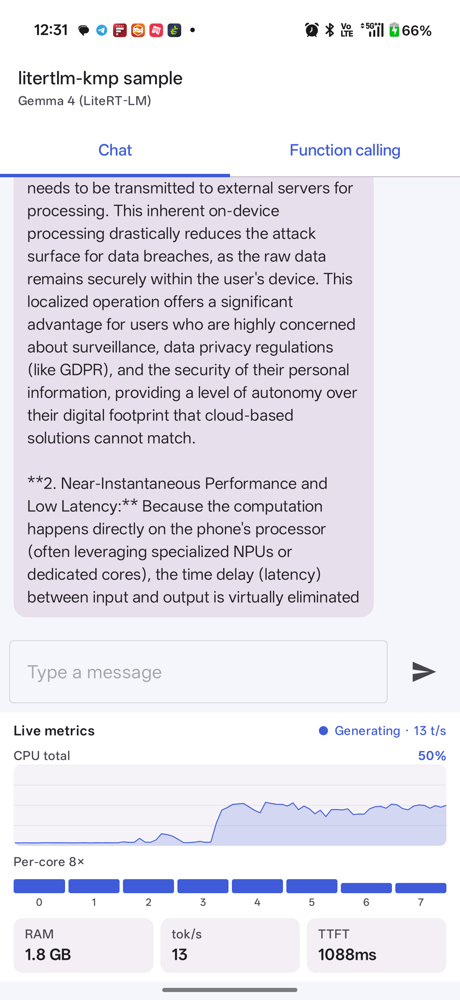
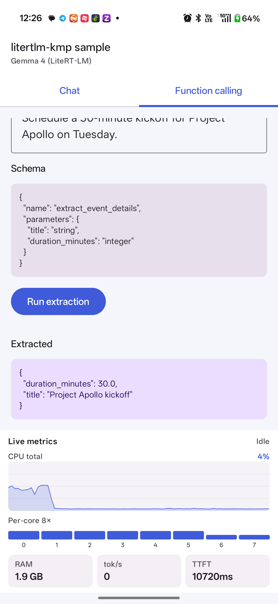

# litertlm-kmp

**A Kotlin Multiplatform wrapper around Google's [LiteRT-LM](https://github.com/google-ai-edge/LiteRT-LM) for running Gemma-family models on-device.**

Dual-licensed: **AGPL-3.0** for open-source / research use; **commercial license** available for proprietary distribution — see [`COMMERCIAL.md`](COMMERCIAL.md).

---

## Why this exists

Shipping a production on-device LLM on Android is significantly harder than the LiteRT-LM samples make it look. You need:

- A clean abstraction over the LiteRT-LM Java SDK so your app code stays platform-independent
- A model-management layer that handles 2GB+ artifact downloads with resume + SHA-256 validation
- Hardware-tier logic that picks the right Gemma variant for the device (and refuses gracefully on under-spec hardware)
- Awareness of OEM quirks — **Realme Dynamic RAM Expansion, Xiaomi Memory Extension, OPPO** all inflate `MemTotal` and silently push under-spec devices into the wrong tier
- A function-calling layer that converts your typed Kotlin schema into the OpenAPI JSON LiteRT-LM expects
- All of the above shaped to run identically on Android and iOS so you can share code across both apps

This library solves all six. The bundled `sample-app/` demonstrates the entire flow with a live CPU & RAM metrics overlay so you can see exactly what running Gemma on-device looks like.

## What the sample app demonstrates

Two features, both running fully on-device — no network, no API key, no cloud bill.

<table>
  <tr>
    <td width="50%" align="center"><b>Streaming chat</b></td>
    <td width="50%" align="center"><b>Function calling</b></td>
  </tr>
  <tr>
    <td></td>
    <td></td>
  </tr>
  <tr>
    <td>Token-by-token streaming via <code>LocalAiEngine.generateStream(...)</code>. Live metrics show <b>~13 tok/s</b>, <b>CPU 50%</b> across 8 cores, <b>TTFT 1088ms</b>, <b>RAM 1.8 GB</b> for Gemma 4 E2B.</td>
    <td>Typed Kotlin <code>ToolSchema.Definition</code> → OpenAPI JSON → LiteRT-LM constrains output → <b>parsed arguments</b> arrive as <code>EngineState.ToolCallEmitted</code>. Here: <code>{"title": "Project Apollo kickoff", "duration_minutes": 30.0}</code>.</td>
  </tr>
</table>

Per-core CPU bars, RAM, tokens/sec, and time-to-first-token update at 4 Hz throughout. The CPU history line shows the workload's full lifecycle: idle → spike → sustained inference → idle.

## Platform support

| Platform | Core engine | Hardware acceleration | Status |
|---|---|---|---|
| **Android** (API 24+) | Production | GPU / NPU via LiteRT delegate selection | Production-vetted on flagship + mid-tier devices |
| **iOS** (arm64 + Apple Silicon sim) | Architecture-ready | Planned: Metal GPU acceleration via LiteRT-LM Swift APIs | Roadmap — v0.3 |

The common module (`lib/src/commonMain`) carries the engine state machine, model-catalog typing, Ktor-backed download manager, and function-calling schema conversion. iOS-side native bindings ship in v0.3 using LiteRT-LM's Swift APIs.

## Quickstart — adding the library to your app

> **Works with plain Android (non-KMP) apps.** Even though the library is published as a Kotlin Multiplatform artifact, the Gradle Module Metadata routes Android consumers directly to the `litertlm-kmp-android` AAR variant — you don't need to apply the `kotlinMultiplatform` plugin or restructure your project. A standard `com.android.application` module with Kotlin (and optionally Compose) is enough.

### 1. Add JitPack to your repositories

In your **root `settings.gradle.kts`**:

```kotlin
dependencyResolutionManagement {
    repositories {
        google()
        mavenCentral()
        maven { url = uri("https://jitpack.io") }
    }
}
```

### 2. Add the dependency

In your **app module's `build.gradle.kts`**:

```kotlin
dependencies {
    implementation("com.github.sagar-develop:litertlm-kmp:v0.2.3")
}
```

### 3. Project requirements

The library compiles against modern Android tooling:

| | Required |
|---|---|
| `minSdk` | 24 (Android 7.0) |
| `compileSdk` | 34 or higher |
| Gradle | 8.0+ |
| Android Gradle Plugin | 8.0+ |
| Kotlin | 2.0+ (project must be on K2) |
| `android.useAndroidX` | `true` in `gradle.properties` (default for new projects) |

If your project predates these, upgrade your toolchain before adding the dependency.

### 4. Manifest permissions

The library declares `ACCESS_NETWORK_STATE` in its own manifest, which merges into your app — no action needed there.

Your app's manifest needs `INTERNET` (you almost certainly already have it):

```xml
<uses-permission android:name="android.permission.INTERNET" />
```

If you use the optional `SpeechRecognizer` surface for voice input, also add:

```xml
<uses-permission android:name="android.permission.RECORD_AUDIO" />
<queries>
    <intent>
        <action android:name="android.speech.RecognitionService" />
    </intent>
</queries>
```

### 5. ProGuard / R8

No additional rules required. The library's public API is annotation-free at the consumer surface, and its native dependencies (LiteRT-LM, MediaPipe) ship their own consumer ProGuard rules via their AARs.

## Wiring the engine in a plain Android app

The library is DI-agnostic. The `sample-app/` module shows the **manual instantiation** path — simplest way to integrate from a vanilla Android project:

```kotlin
import com.sagar.aicore.AndroidHardwareProvider
import com.sagar.aicore.AndroidPlatformFolders
import com.sagar.aicore.KtorModelManager
import com.sagar.aicore.LiteRtLmLocalAiEngine
import io.ktor.client.HttpClient

class MyEngineHolder(context: Context) {
    private val httpClient = HttpClient()
    private val hardware = AndroidHardwareProvider(context.applicationContext)
    private val folders = AndroidPlatformFolders(context.applicationContext)

    val modelManager = KtorModelManager(httpClient, folders)
    val engine = LiteRtLmLocalAiEngine(hardware)
}
```

Hold one instance for the app lifetime (typically in your `Application` subclass or your existing DI graph). If you use Hilt, declare these as `@Singleton @Provides` bindings; if you use Koin, the equivalent `single { ... }`. If you use **kotlin-inject** (the library's own DI graph), see [`AiEngineComponent`](lib/src/commonMain/kotlin/com/sagar/aicore/di/AiEngineComponent.kt) and [`AndroidAiEngineComponent`](lib/src/androidMain/kotlin/com/sagar/aicore/di/AndroidAiEngineComponent.kt) for the ready-made interface.

### Streaming chat

```kotlin
val engine = myEngineHolder.engine

engine.initializeEngine(modelPath = "/data/data/your.app/files/gemma-4-E2B-it.litertlm")

engine.generateStream(
    AiEngineRequest(
        formattedPrompt = "Explain how RoPE positional encodings work.",
        temperature = 0.7f,
        maxTokens = 1024,
    )
).collect { state ->
    when (state) {
        is EngineState.TokenGenerated -> print(state.data)
        is EngineState.Error -> error(state.fault.message ?: "Engine fault")
        else -> Unit
    }
}
```

### Function calling (structured output)

You define the schema once in Kotlin. The library converts it to the OpenAPI 3.0 JSON LiteRT-LM expects, asks the model to *call* the function rather than reply in free text, and surfaces the parsed arguments back as a `Map<String, Any?>`.

```kotlin
val toolSchema = ToolSchema.Definition(
    name = "extract_event_details",
    description = "Extract structured event details from a sentence.",
    parameters = listOf(
        ToolParameter("title", ToolParameterType.StringT, "Event title.", required = true),
        ToolParameter("duration_minutes", ToolParameterType.IntegerT, "Length in minutes.", required = true),
    ),
)

engine.generateStream(
    AiEngineRequest(
        formattedPrompt = "Schedule a 30-minute kickoff for Project Apollo on Tuesday.",
        requireStructuredOutput = true,
        toolSchema = toolSchema,
    )
).collect { state ->
    if (state is EngineState.ToolCallEmitted) {
        println("Extracted: ${state.arguments}")
        // → {title=Project Apollo kickoff, duration_minutes=30.0}
    }
}
```

**How it works under the hood:**

1. [`ToolSchemaConverter.toOpenApiJson()`](lib/src/commonMain/kotlin/com/sagar/aicore/ToolSchemaConverter.kt) walks your typed `Definition` and emits canonical OpenAPI 3.0 JSON (`{"name": "...", "parameters": {"type": "object", "properties": {...}, "required": [...]}}`).
2. [`LiteRtLmLocalAiEngine.runStructured(...)`](lib/src/androidMain/kotlin/com/sagar/aicore/LiteRtLmLocalAiEngine.kt) registers the JSON as a LiteRT-LM `OpenApiTool` with `automaticToolCalling = false`, then sends the prompt with the system instruction `"you MUST call the tool"`.
3. The model is constrained at the token level to emit a valid tool call rather than free text. Each call comes back via `message.toolCalls[]` as `(name, arguments: Map<String, Any?>)`.
4. The library re-emits each call as `EngineState.ToolCallEmitted` for your consumer to read.

A few gotchas worth knowing:

- **Numeric types come back as `Double`.** JSON has no integer/float distinction at the wire level, so an `IntegerT` parameter still arrives as `Double`. Coerce with `(it as Number).toInt()`.
- **Snake_case is preferred for param names.** LiteRT-LM also accepts camelCase, but snake_case round-trips cleaner with the JSON schema vocabulary.
- **Arrays nest.** `ToolParameterType.ArrayT(ToolParameterType.StringT)` becomes `{"type": "array", "items": {"type": "string"}}` — see [`ToolSchemaConverterTest`](lib/src/commonTest/kotlin/com/sagar/aicore/ToolSchemaConverterTest.kt) for the round-trip cases.

### Embedding for RAG

```kotlin
import com.sagar.aicore.MediaPipeEmbeddingEngine

val embeddings = MediaPipeEmbeddingEngine(context)
val vector: FloatArray = embeddings.embed("Your document chunk here")
// → float vector ready for cosine similarity against an in-memory store
```

### Model download with progress + SHA-256

```kotlin
// `modelManager` from MyEngineHolder above
modelManager.downloadModel(
    url = "https://your-cdn/gemma-4-E2B-it.litertlm",
    modelName = "gemma-4-E2B-it.litertlm",
    expectedSha256 = "...",  // optional, fails atomically on mismatch
).collect { state ->
    when (state) {
        is DownloadState.Downloading -> updateProgressBar(state.progress)
        is DownloadState.Success -> launchEngine(state.localPath)
        is DownloadState.Error -> showError(state.message)
        else -> Unit
    }
}
```

The sample-app's [`SampleViewModel`](sample-app/src/main/java/com/sagar/litertlmsample/llm/SampleViewModel.kt) shows the full real-world flow: download → init → generate → emit metrics. Read it end-to-end for a working reference.

## Running the sample app

The `sample-app/` module is a single-activity Compose app that exercises the entire library — streaming chat, function-calling, and a live CPU & RAM metrics overlay that updates 4× per second so you can see exactly what Gemma 4 is doing to your device while it generates.

### 1. Host the model weights yourself

The repo does **not** ship binary model weights — Gemma's license permits redistribution but each consumer is responsible for hosting. The sample app downloads from any HTTPS URL you point it at on first launch. Recommended path: **download from HuggingFace, host on Firebase Storage**.

#### Step 1 — Download a Gemma 4 LiteRT-LM `.litertlm` from HuggingFace

LiteRT-LM-formatted Gemma weights live on the [litert-community](https://huggingface.co/litert-community) HuggingFace org:

- Sign in to HuggingFace and accept the Gemma terms-of-use on the model card (one-time).
- Download the `.litertlm` artifact for the variant you want — Gemma 4 E2B (~2.5 GB, fits 6–9 GB RAM devices) is the safe default.
- Keep the file on disk for the next step.

#### Step 2 — Upload to Firebase Storage

If you don't already have a Firebase project, [console.firebase.google.com](https://console.firebase.google.com) → **Add project** (free Spark plan is sufficient).

1. In the Firebase console, open **Storage** → **Get started** → keep production rules → choose your region.
2. Click **Upload file** → pick the `.litertlm` you downloaded. Wait for the upload to complete (the file is ~2.5 GB; 5–15 min depending on your uplink).
3. Click the uploaded file → switch to the **Name** column → click the small "download" icon → "**Copy access token URL**". The URL looks like:
   ```
   https://firebasestorage.googleapis.com/v0/b/YOUR-PROJECT.firebasestorage.app/o/gemma-4-E2B-it.litertlm?alt=media&token=...
   ```
4. Treat this URL as semi-public — anyone with it can download from your bucket. Firebase Storage's free tier covers ~10 GB egress / month; for higher volume, use Cloudflare R2 or S3 instead.

#### Step 3 — Paste the URL into `sample-app/local.properties`

```bash
cp sample-app/local.properties.template sample-app/local.properties
```

Then edit `sample-app/local.properties`:

```properties
model.url=https://firebasestorage.googleapis.com/v0/b/YOUR-PROJECT.firebasestorage.app/o/gemma-4-E2B-it.litertlm?alt=media&token=YOUR-TOKEN
model.fileName=gemma-4-E2B-it.litertlm
model.sizeBytes=2588000000
```

`local.properties` is gitignored — your URL and token never get committed.

### 2. Build and install

```bash
./gradlew :sample-app:installDebug
adb shell am start -n com.sagar.litertlmsample/.MainActivity
```

First launch shows the Setup screen → **Download & initialize**. The download happens once (5–15 min depending on your network) and persists in `/data/data/com.sagar.litertlmsample/files/models/`. Subsequent launches skip straight to the Ready state.

### 3. What you'll see — and how to verify both features

The app opens on the **Setup screen** the first time. Tap **Download & initialize** — the model downloads once (5–15 min on first launch, ~zero on subsequent launches because the file persists). When the Setup screen finishes, two tabs appear.

#### Chat tab — verify streaming works

1. Type any prompt in the text field. Example: *"Explain RoPE positional encodings in three short paragraphs."*
2. Tap **Send**.
3. Within ~1 second the assistant bubble appears with an ellipsis placeholder.
4. Tokens start flowing — the bubble fills in, sentence by sentence.

What confirms it's working:

- The metrics overlay header switches from **"Idle"** to **"⏺ Generating · N t/s"** where N is the current tokens-per-second.
- The **CPU total** line spikes from idle baseline (~5%) up to 40–60% depending on your device.
- The per-core bars saturate — most cores will be at high frequency utilization.
- **TTFT** shows the time-to-first-token in ms (typical: 800–1500 ms for the first prompt, ~200–500 ms for follow-ups thanks to the XNNPACK warm cache).
- **RAM** climbs to ~1.5–2.0 GB and stays there (Gemma 4 E2B's KV cache + weights are resident).
- When generation finishes, the indicator returns to **"Idle"** and tokens/sec drops to 0.

#### Function calling tab — verify structured output works

1. The tab opens with a pre-filled prompt: *"Schedule a 30-minute kickoff for Project Apollo on Tuesday."*
2. The schema preview shows the typed `ToolSchema.Definition`: a tool named `extract_event_details` with `title: string` and `duration_minutes: integer`.
3. Tap **Run extraction**.
4. After ~10–15 seconds (LiteRT-LM's structured-output path is a bit slower than free-text streaming because it constrains decoding at the token level), the **Extracted** box populates with the parsed JSON.

Expected result for the default prompt:

```json
{
  "duration_minutes": 30.0,
  "title": "Project Apollo kickoff"
}
```

Edit the prompt and tap Run again to test other inputs. The schema preview is read-only — to change parameters, edit `SampleViewModel.runFunctionCall()` in [the source](sample-app/src/main/java/com/sagar/litertlmsample/llm/SampleViewModel.kt).

#### Live metrics overlay — what each panel means

| Element | Source | What it tells you |
|---|---|---|
| **CPU total** line | `Process.getElapsedCpuTime()` deltas, normalized by core count | Process-wide CPU usage as average per-core (0–100%). Spikes during inference. |
| **Per-core 8×** bars | `/sys/devices/system/cpu/cpuN/cpufreq/scaling_cur_freq` ÷ max freq | Each core's current frequency as a percentage of its silicon max. big.LITTLE asymmetry visible — performance cores climb higher than efficiency cores. |
| **RAM** | `Debug.MemoryInfo.totalPss` | Process proportional set size in MB/GB. Gemma 4 E2B sits around 1.8 GB resident. |
| **tok/s** | rolling 1-second window over `EngineState.TokenGenerated` emissions | Real-time generation throughput. Higher = faster. |
| **TTFT** | `SystemClock.elapsedRealtime()` from request submission to first token | Latency from "user tapped send" to "first token rendered". Cold first prompt = ~1.5 s; warm follow-ups = sub-second. |
| **Generating · N t/s** badge | derived from `EngineState.TokenGenerated` activity | Live indicator while inference is in flight. Goes away when the stream completes. |

All updated at 4 Hz so the chart flows smoothly while inference is running.

## Architecture at a glance

```
            ┌─────────────────────────────────────────┐
            │     Your app (Compose / SwiftUI / …)    │
            └─────────────────────────────────────────┘
                              │
            ┌─────────────────▼─────────────────────────┐
            │  EngineRegistry  ←  HardwareProvider      │
            │  (picks LiteRT vs MediaPipe vs fallback  │
            │   based on device RAM tier)              │
            └─────────────────┬─────────────────────────┘
                              │
       ┌──────────────────────┼────────────────────────┐
       ▼                      ▼                        ▼
 LocalAiEngine          EmbeddingEngine          ModelManager
 (LiteRT-LM /           (MediaPipe Tasks         (Ktor download
  Gemma 4)              Text Embedder)            + SHA-256 +
                                                  atomic move)
```

See [`ARCHITECTURE.md`](ARCHITECTURE.md) for the full design rationale, including how the RAM-tier policy works and why the OEM RAM-expansion detection is necessary.

## Enterprise support, custom implementations & architectural advising

If your team is migrating from cloud LLM APIs to on-device inference, designing a Kotlin Multiplatform AI stack, or needs a commercial license for proprietary distribution:

**[sgupta8874@gmail.com](mailto:sgupta8874@gmail.com)**

Typical engagements:

- **Commercial licensing** (see [`COMMERCIAL.md`](COMMERCIAL.md))
- **Architectural advisory** — KMP module layout, agent patterns on top of `LocalAiEngine`, cloud-to-edge migration playbooks
- **Custom implementations** — fine-tune integration, multi-model orchestration, RAG pipelines, function-calling schemas tuned to your domain

## Roadmap

- **v0.1** — initial library release. Android target production-ready, iOS targets compile but native engine bindings deferred.
- **v0.2** (this release) — `sample-app/` Compose Android app with live CPU + RAM + tokens/sec metrics overlay. Library restructured into `:lib` subproject; published as `com.sagar:litertlm-kmp`.
- **v0.3** — iOS native engine implementation via LiteRT-LM's Swift Metal-accelerated APIs.
- **v0.4** — Benchmark suite (tokens/sec, RAM ceiling, battery drain) across a representative device matrix.

## Repo layout

```
litertlm-kmp/
├── lib/                       ← the published library
│   ├── src/commonMain/        ← engine interfaces, ModelManager, ToolSchemaConverter
│   ├── src/androidMain/       ← LiteRT-LM JNI, MediaPipe text embedder, OEM-aware HardwareProvider
│   └── src/iosMain/           ← iOS PlatformFolders (full engine actuals — v0.3)
├── sample-app/                ← Compose Android app demonstrating the library
│   ├── src/main/kotlin/com/sagar/litertlmsample/
│   │   ├── metrics/           ← CpuMonitor, MemoryMonitor, TokenRateMonitor
│   │   ├── llm/               ← EngineHolder + SampleViewModel
│   │   └── ui/                ← Chat / FunctionCall / MetricsOverlay
│   └── local.properties.template  ← model URL config; copy to local.properties
├── ARCHITECTURE.md            ← module layout + design rationale
└── COMMERCIAL.md              ← dual-licensing terms
```

## License

Dual-licensed under the **GNU Affero General Public License v3.0** ([`LICENSE`](LICENSE)) for open-source / research use, and under a **commercial license** for proprietary distribution ([`COMMERCIAL.md`](COMMERCIAL.md)).

Copyright © 2026 Sagar Gupta.

## Built with

- [LiteRT-LM](https://github.com/google-ai-edge/LiteRT-LM) (Apache-2.0) — Google's on-device LLM runtime
- [MediaPipe](https://github.com/google-ai-edge/mediapipe) (Apache-2.0) — text-embedder bindings
- [Ktor](https://ktor.io) (Apache-2.0) — HTTP client for model downloads
- [Okio](https://square.github.io/okio/) (Apache-2.0) — streaming file I/O + SHA-256
- [kotlin-inject](https://github.com/evant/kotlin-inject) (Apache-2.0) — compile-time DI
- [Jetpack Compose](https://developer.android.com/jetpack/compose) (Apache-2.0) — sample-app UI
- [Napier](https://github.com/AAkira/Napier) (Apache-2.0) — KMP-friendly logging
