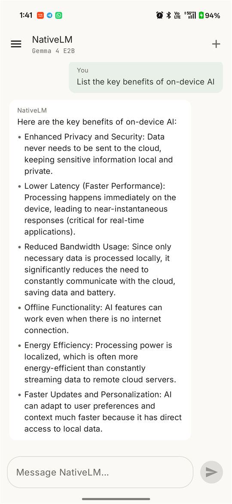
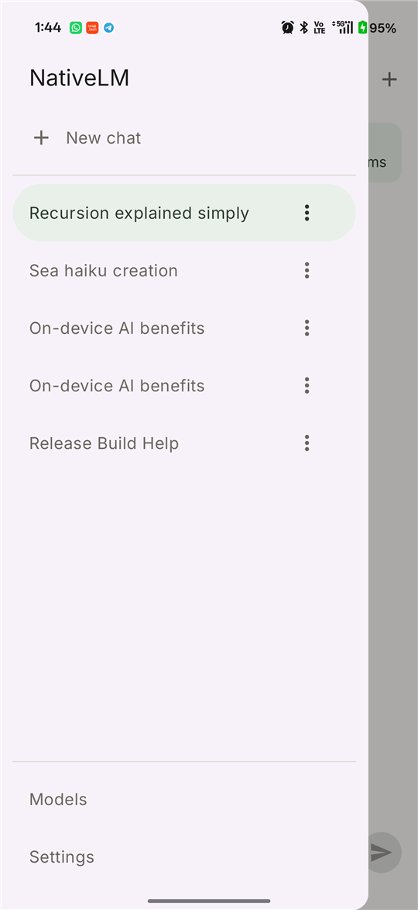
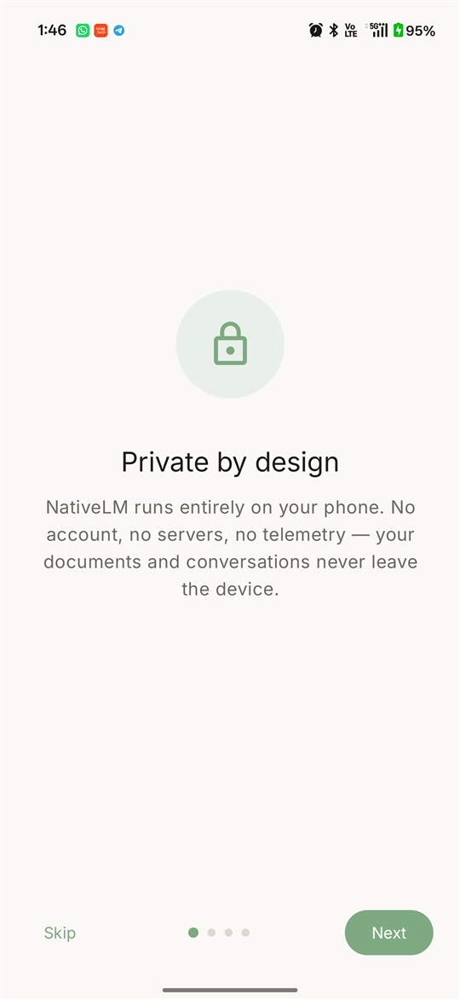
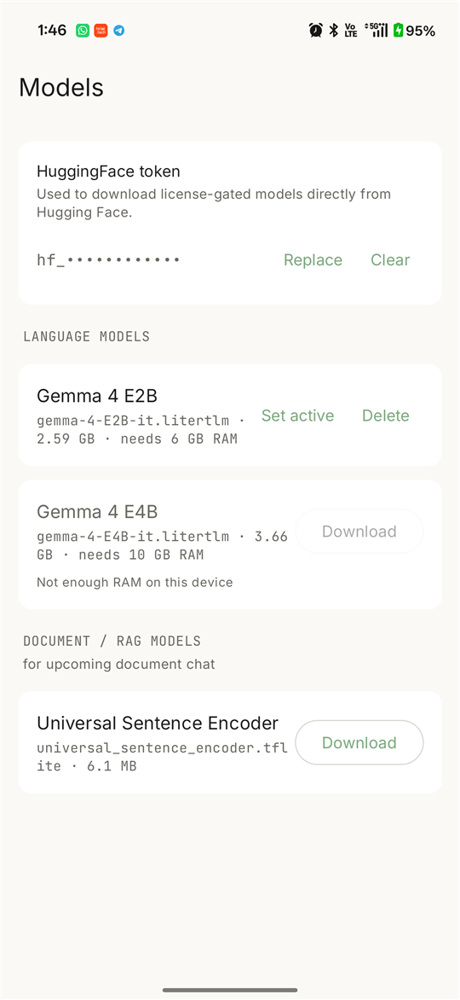

# litertlm-kmp

**A Kotlin Multiplatform wrapper around Google's [LiteRT-LM](https://github.com/google-ai-edge/LiteRT-LM) for running Gemma-family models on-device.**

Dual-licensed: **AGPL-3.0** for open-source / research use; **commercial license** available for proprietary distribution — see [`COMMERCIAL.md`](COMMERCIAL.md).

---

## Why this exists

Shipping a production on-device LLM on Android is significantly harder than the LiteRT-LM samples make it look. You need:

- A clean abstraction over the LiteRT-LM Java SDK so your app code stays platform-independent
- A model-management layer that handles 2GB+ artifact downloads with resume + SHA-256 validation
- Hardware-tier logic that picks the right Gemma variant for the device (and refuses gracefully on under-spec hardware)
- Awareness of OEM quirks — **Realme Dynamic RAM Expansion, Xiaomi Memory Extension, OPPO** all inflate `MemTotal` and silently push under-spec devices into the wrong tier
- A function-calling layer that converts your typed Kotlin schema into the OpenAPI JSON LiteRT-LM expects
- Stateful, KV-cache-reusing chat sessions so multi-turn memory is lossless and time-to-first-token stays flat as a conversation grows — instead of re-sending the whole history every turn
- All of the above shaped to run identically on Android and iOS so you can share code across both apps

This library solves all six. The bundled `sample-app/` — **NativeLM** — is a real,
shipped product (private on-device chat with conversation history) built on top
of the engine, so you can see exactly what running Gemma on-device looks like.

## The showcase app — NativeLM

A private, fully on-device AI chat for Android — no account, no network, no
telemetry. Everything below runs locally on Gemma 4 (E2B / E4B) via this engine.

<table>
  <tr>
    <td width="25%" align="center"><b>On-device chat</b></td>
    <td width="25%" align="center"><b>Conversation history</b></td>
    <td width="25%" align="center"><b>Private by design</b></td>
    <td width="25%" align="center"><b>Bring your own model</b></td>
  </tr>
  <tr>
    <td></td>
    <td></td>
    <td></td>
    <td></td>
  </tr>
  <tr>
    <td>Token-by-token streaming with rich Markdown (incl. tables), via <code>LocalAiEngine</code>.</td>
    <td><b>Stateful KV-cache sessions</b> (<code>openChatSession</code>) — lossless multi-turn memory with no history re-sending, model-generated titles, ObjectBox persistence.</td>
    <td>Nothing leaves the device. No account, no servers, no telemetry.</td>
    <td>Download Gemma variants on demand with your own Hugging Face token; hardware-tier gating refuses under-spec devices.</td>
  </tr>
</table>

Also supported by the engine: **function calling** (typed Kotlin
`ToolSchema.Definition` → OpenAPI JSON → constrained output as
`EngineState.ToolCallEmitted`), **vision** (image input on multimodal Gemma 4),
and **real native cancellation** of in-flight generation.

## Platform support

| Platform | Core engine | Hardware acceleration | Status |
|---|---|---|---|
| **Android** (API 24+) | Production | GPU / NPU via LiteRT delegate selection | Production-vetted on flagship + mid-tier devices |
| **iOS** (arm64 + Apple Silicon sim) | Architecture-ready | Planned: Metal GPU acceleration via LiteRT-LM Swift APIs | Roadmap |

The common module (`lib/src/commonMain`) carries the engine state machine, model-catalog typing, Ktor-backed download manager, and function-calling schema conversion. iOS-side native bindings are on the roadmap using LiteRT-LM's Swift APIs.

## Quickstart — adding the library to your app

> **Works with plain Android (non-KMP) apps.** Even though the library is published as a Kotlin Multiplatform artifact, the Gradle Module Metadata routes Android consumers directly to the `litertlm-kmp-android` AAR variant — you don't need to apply the `kotlinMultiplatform` plugin or restructure your project. A standard `com.android.application` module with Kotlin (and optionally Compose) is enough.

### 1. Add JitPack to your repositories

In your **root `settings.gradle.kts`**:

```kotlin
dependencyResolutionManagement {
    repositories {
        google()
        mavenCentral()
        maven { url = uri("https://jitpack.io") }
    }
}
```

### 2. Add the dependency

In your **app module's `build.gradle.kts`**:

```kotlin
dependencies {
    implementation("com.github.sagar-develop:litertlm-kmp:v0.4.0")
}
```

### 3. Project requirements

The library compiles against modern Android tooling:

| | Required |
|---|---|
| `minSdk` | 24 (Android 7.0) |
| `compileSdk` | 34 or higher |
| Gradle | 8.0+ |
| Android Gradle Plugin | 8.0+ |
| Kotlin | 2.0+ (project must be on K2) |
| `android.useAndroidX` | `true` in `gradle.properties` (default for new projects) |

If your project predates these, upgrade your toolchain before adding the dependency.

### 4. Manifest permissions

The library declares `ACCESS_NETWORK_STATE` in its own manifest, which merges into your app — no action needed there.

Your app's manifest needs `INTERNET` (you almost certainly already have it):

```xml
<uses-permission android:name="android.permission.INTERNET" />
```

If you use the optional `SpeechRecognizer` surface for voice input, also add:

```xml
<uses-permission android:name="android.permission.RECORD_AUDIO" />
<queries>
    <intent>
        <action android:name="android.speech.RecognitionService" />
    </intent>
</queries>
```

### 5. ProGuard / R8

No additional rules required. The library's public API is annotation-free at the consumer surface, and its native dependencies (LiteRT-LM, MediaPipe) ship their own consumer ProGuard rules via their AARs.

## Wiring the engine in a plain Android app

The library is DI-agnostic. The `sample-app/` module shows the **manual instantiation** path — simplest way to integrate from a vanilla Android project:

```kotlin
import com.sagar.aicore.AndroidHardwareProvider
import com.sagar.aicore.AndroidPlatformFolders
import com.sagar.aicore.KtorModelManager
import com.sagar.aicore.LiteRtLmLocalAiEngine
import io.ktor.client.HttpClient

class MyEngineHolder(context: Context) {
    private val httpClient = HttpClient()
    private val hardware = AndroidHardwareProvider(context.applicationContext)
    private val folders = AndroidPlatformFolders(context.applicationContext)

    val modelManager = KtorModelManager(httpClient, folders)
    val engine = LiteRtLmLocalAiEngine(hardware)
}
```

Hold one instance for the app lifetime (typically in your `Application` subclass or your existing DI graph). If you use Hilt, declare these as `@Singleton @Provides` bindings; if you use Koin, the equivalent `single { ... }`. If you use **kotlin-inject** (the library's own DI graph), see [`AiEngineComponent`](lib/src/commonMain/kotlin/com/sagar/aicore/di/AiEngineComponent.kt) and [`AndroidAiEngineComponent`](lib/src/androidMain/kotlin/com/sagar/aicore/di/AndroidAiEngineComponent.kt) for the ready-made interface.

### Streaming chat

```kotlin
val engine = myEngineHolder.engine

engine.initializeEngine(modelPath = "/data/data/your.app/files/gemma-4-E2B-it.litertlm")

engine.generateStream(
    AiEngineRequest(
        formattedPrompt = "Explain how RoPE positional encodings work.",
        temperature = 0.7f,
        maxTokens = 1024,
    )
).collect { state ->
    when (state) {
        is EngineState.TokenGenerated -> print(state.data)
        is EngineState.Error -> error(state.fault.message ?: "Engine fault")
        else -> Unit
    }
}
```

### Function calling (structured output)

You define the schema once in Kotlin. The library converts it to the OpenAPI 3.0 JSON LiteRT-LM expects, asks the model to *call* the function rather than reply in free text, and surfaces the parsed arguments back as a `Map<String, Any?>`.

```kotlin
val toolSchema = ToolSchema.Definition(
    name = "extract_event_details",
    description = "Extract structured event details from a sentence.",
    parameters = listOf(
        ToolParameter("title", ToolParameterType.StringT, "Event title.", required = true),
        ToolParameter("duration_minutes", ToolParameterType.IntegerT, "Length in minutes.", required = true),
    ),
)

engine.generateStream(
    AiEngineRequest(
        formattedPrompt = "Schedule a 30-minute kickoff for Project Apollo on Tuesday.",
        requireStructuredOutput = true,
        toolSchema = toolSchema,
    )
).collect { state ->
    if (state is EngineState.ToolCallEmitted) {
        println("Extracted: ${state.arguments}")
        // → {title=Project Apollo kickoff, duration_minutes=30.0}
    }
}
```

**How it works under the hood:**

1. [`ToolSchemaConverter.toOpenApiJson()`](lib/src/commonMain/kotlin/com/sagar/aicore/ToolSchemaConverter.kt) walks your typed `Definition` and emits canonical OpenAPI 3.0 JSON (`{"name": "...", "parameters": {"type": "object", "properties": {...}, "required": [...]}}`).
2. [`LiteRtLmLocalAiEngine.runStructured(...)`](lib/src/androidMain/kotlin/com/sagar/aicore/LiteRtLmLocalAiEngine.kt) registers the JSON as a LiteRT-LM `OpenApiTool` with `automaticToolCalling = false`, then sends the prompt with the system instruction `"you MUST call the tool"`.
3. The model is constrained at the token level to emit a valid tool call rather than free text. Each call comes back via `message.toolCalls[]` as `(name, arguments: Map<String, Any?>)`.
4. The library re-emits each call as `EngineState.ToolCallEmitted` for your consumer to read.

A few gotchas worth knowing:

- **Numeric types come back as `Double`.** JSON has no integer/float distinction at the wire level, so an `IntegerT` parameter still arrives as `Double`. Coerce with `(it as Number).toInt()`.
- **Snake_case is preferred for param names.** LiteRT-LM also accepts camelCase, but snake_case round-trips cleaner with the JSON schema vocabulary.
- **Arrays nest.** `ToolParameterType.ArrayT(ToolParameterType.StringT)` becomes `{"type": "array", "items": {"type": "string"}}` — see [`ToolSchemaConverterTest`](lib/src/commonTest/kotlin/com/sagar/aicore/ToolSchemaConverterTest.kt) for the round-trip cases.

### Vision (image input)

Multimodal Gemma 4 (E2B / E4B) accepts an image alongside the text prompt. Attach an `Attachment.Image` to the request — the library bundles it as a LiteRT-LM `Content.ImageBytes` next to the prompt text. Engines that don't support vision ignore the attachment rather than failing, so the same call is safe across engines; gate your UI on `engine.descriptor.supportsVision` if you want to hide the affordance when unsupported.

```kotlin
val jpegBytes: ByteArray = /* a photo or screenshot */

engine.generateStream(
    AiEngineRequest(
        formattedPrompt = "Summarize the text visible in this image.",
        attachments = listOf(Attachment.Image(bytes = jpegBytes, mimeType = "image/jpeg")),
    )
).collect { state ->
    if (state is EngineState.TokenGenerated) print(state.data)
}
```

The engine is initialized with `visionBackend = Backend.CPU()` and `maxNumImages = 1`. The `.litertlm` bundle you load must include vision-encoder weights (the standard Gemma 4 E2B / E4B artifacts do) — a text-only build fails at init when a vision backend is set. Audio attachments are accepted by the API but not yet wired to inference.

### Embedding for RAG

```kotlin
import com.sagar.aicore.MediaPipeEmbeddingEngine

val embeddings = MediaPipeEmbeddingEngine(context)
val vector: FloatArray = embeddings.embed("Your document chunk here")
// → float vector ready for cosine similarity against an in-memory store
```

### Model download with progress + SHA-256

```kotlin
// `modelManager` from MyEngineHolder above
modelManager.downloadModel(
    url = "https://your-cdn/gemma-4-E2B-it.litertlm",
    modelName = "gemma-4-E2B-it.litertlm",
    expectedSha256 = "...",  // optional, fails atomically on mismatch
).collect { state ->
    when (state) {
        is DownloadState.Downloading -> updateProgressBar(state.progress)
        is DownloadState.Success -> launchEngine(state.localPath)
        is DownloadState.Error -> showError(state.message)
        else -> Unit
    }
}
```

The sample-app's [`NativeLmViewModel`](sample-app/src/main/java/com/nativelm/app/llm/NativeLmViewModel.kt) shows the full real-world flow: download → init → open a stateful chat session → stream turns. Read it end-to-end for a working reference.

## Running the sample app

The `sample-app/` module is **NativeLM** — a Compose app that exercises the whole
library: branded onboarding → model management → a chat surface with stateful
KV-cache sessions and conversation history. Models are **downloaded on demand
from Hugging Face with your own token** (never bundled), and a previously
selected model auto-loads from disk on later launches.

### 1. Build and install

```bash
./gradlew :sample-app:assembleDebug
adb install -r sample-app/build/outputs/apk/debug/sample-app-debug.apk
adb shell am start -n com.nativelm.app/.MainActivity
```

A signed, R8-minified release build is also wired (`:sample-app:assembleRelease`)
— see [`sample-app/README.md`](sample-app/README.md).

### 2. First-run flow

The repo does **not** ship binary model weights — Gemma's license permits
redistribution but each consumer hosts their own; NativeLM downloads directly
from Hugging Face.

1. **Onboarding** → **Model Management**.
2. Paste a Hugging Face **read token** (Settings → Access Tokens on huggingface.co)
   into the token field. It's stored encrypted on-device (`EncryptedSharedPreferences`).
3. **Download** Gemma 4 E2B (~2.6 GB, for 6 GB+ devices) — resumable, SHA-256
   validated. Tap **Set active** to load it into memory.
4. **Chat.** Type a prompt and watch token-by-token streaming with live
   tokens/sec + TTFT. The model file persists, so later launches load it directly.

The download URLs + per-model metadata live in
[`NativeLmModelCatalog`](sample-app/src/main/java/com/nativelm/app/llm/NativeLmModelCatalog.kt)
(an app-supplied `ModelCatalog` over the engine's typed descriptors).

### 3. What confirms it's working

- **Streaming** — the assistant bubble fills in token-by-token; a quiet
  `TTFT · N tok/s` line shows live throughput (≈20 tok/s on a recent flagship for
  Gemma 4 E2B, CPU backend).
- **Multi-turn memory** — tell it a fact, then ask about it several turns later;
  it recalls correctly **without** the app re-sending history (the KV-cache session
  holds the context). Time-to-first-token stays flat as the chat grows.
- **Conversation history** — the drawer lists past conversations (auto-titled by
  the model); switching one re-prefills its history ("Building understanding…")
  then reuses the cache.
- **Stop** truly interrupts the native decode loop, not just the UI.

## Architecture at a glance

```
            ┌─────────────────────────────────────────┐
            │     Your app (Compose / SwiftUI / …)    │
            └─────────────────────────────────────────┘
                              │
            ┌─────────────────▼─────────────────────────┐
            │  EngineRegistry  ←  HardwareProvider      │
            │  (picks LiteRT vs MediaPipe vs fallback  │
            │   based on device RAM tier)              │
            └─────────────────┬─────────────────────────┘
                              │
       ┌──────────────────────┼────────────────────────┐
       ▼                      ▼                        ▼
 LocalAiEngine          EmbeddingEngine          ModelManager
 (LiteRT-LM /           (MediaPipe Tasks         (Ktor download
  Gemma 4)              Text Embedder)            + SHA-256 +
                                                  atomic move)
```

See [`ARCHITECTURE.md`](ARCHITECTURE.md) for the full design rationale, including how the RAM-tier policy works and why the OEM RAM-expansion detection is necessary.

## Enterprise support, custom implementations & architectural advising

If your team is migrating from cloud LLM APIs to on-device inference, designing a Kotlin Multiplatform AI stack, or needs a commercial license for proprietary distribution:

**[sgupta8874@gmail.com](mailto:sgupta8874@gmail.com)**

Typical engagements:

- **Commercial licensing** (see [`COMMERCIAL.md`](COMMERCIAL.md))
- **Architectural advisory** — KMP module layout, agent patterns on top of `LocalAiEngine`, cloud-to-edge migration playbooks
- **Custom implementations** — fine-tune integration, multi-model orchestration, RAG pipelines, function-calling schemas tuned to your domain

## Roadmap

- **v0.1** — initial library release. Android target production-ready, iOS targets compile but native engine bindings deferred.
- **v0.2** — `sample-app/` Compose Android app with live CPU + RAM + tokens/sec metrics overlay. Library restructured into `:lib` subproject; published as `com.sagar:litertlm-kmp`.
- **v0.2.4** — multimodal vision: image attachments flow through `EngineConfig.visionBackend` + `Content.ImageBytes`; `descriptor.supportsVision` is now `true`.
- **v0.3.0** — **stateful KV-cache chat sessions** (`openChatSession` / `ChatSession`): lossless multi-turn memory with no history re-sending; **real native cancellation** (`cancel()`); explicit `EngineConfig.backend` selection (on-device benchmarking picked `CPU(6)`); `SamplerConfig` temperature/seed plumbed through. The NativeLM showcase app gains conversation history (ObjectBox), model-generated titles, and a signed, R8-minified release build (engine ships its own consumer ProGuard rules).
- **v0.4.0** (this release) — **Local NotebookLM**: fully on-device **document RAG** in the NativeLM app — import a PDF/text source, and the app extracts → chunks → embeds (MediaPipe USE-Lite) → stores in an ObjectBox **HNSW** vector index → retrieves project-scoped, relevance-gated context → answers grounded with **citations**. **Projects** (NotebookLM-style notebooks) keep each chat scoped to its own sources; default chat stays general. Engine: `consumer-rules.pro` now keeps the MediaPipe text-embedder + Flogger + protobuf so RAG embedding survives R8 minification.
- **Future** — iOS native engine via LiteRT-LM's Swift Metal-accelerated APIs; a benchmark suite (tokens/sec, RAM ceiling, battery drain) across a device matrix.

## Repo layout

```
litertlm-kmp/
├── lib/                       ← the published library
│   ├── src/commonMain/        ← engine interfaces, ModelManager, ToolSchemaConverter
│   ├── src/androidMain/       ← LiteRT-LM JNI, MediaPipe text embedder, OEM-aware HardwareProvider
│   └── src/iosMain/           ← iOS PlatformFolders (full engine actuals — v0.3)
├── sample-app/                ← Compose Android app demonstrating the library
│   ├── src/main/kotlin/com/sagar/litertlmsample/
│   │   ├── metrics/           ← CpuMonitor, MemoryMonitor, TokenRateMonitor
│   │   ├── llm/               ← EngineHolder + SampleViewModel
│   │   └── ui/                ← Chat / FunctionCall / MetricsOverlay
│   └── local.properties.template  ← model URL config; copy to local.properties
├── ARCHITECTURE.md            ← module layout + design rationale
└── COMMERCIAL.md              ← dual-licensing terms
```

## License

Dual-licensed under the **GNU Affero General Public License v3.0** ([`LICENSE`](LICENSE)) for open-source / research use, and under a **commercial license** for proprietary distribution ([`COMMERCIAL.md`](COMMERCIAL.md)).

Copyright © 2026 Sagar Gupta.

## Built with

- [LiteRT-LM](https://github.com/google-ai-edge/LiteRT-LM) (Apache-2.0) — Google's on-device LLM runtime
- [MediaPipe](https://github.com/google-ai-edge/mediapipe) (Apache-2.0) — text-embedder bindings
- [Ktor](https://ktor.io) (Apache-2.0) — HTTP client for model downloads
- [Okio](https://square.github.io/okio/) (Apache-2.0) — streaming file I/O + SHA-256
- [kotlin-inject](https://github.com/evant/kotlin-inject) (Apache-2.0) — compile-time DI
- [Jetpack Compose](https://developer.android.com/jetpack/compose) (Apache-2.0) — sample-app UI
- [Napier](https://github.com/AAkira/Napier) (Apache-2.0) — KMP-friendly logging
