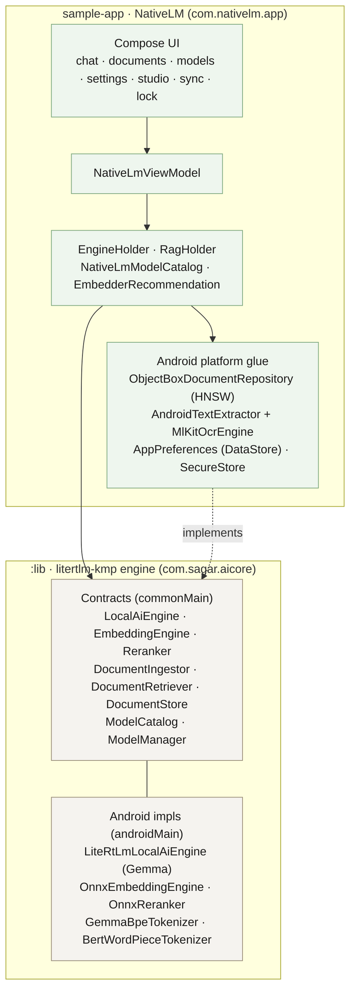
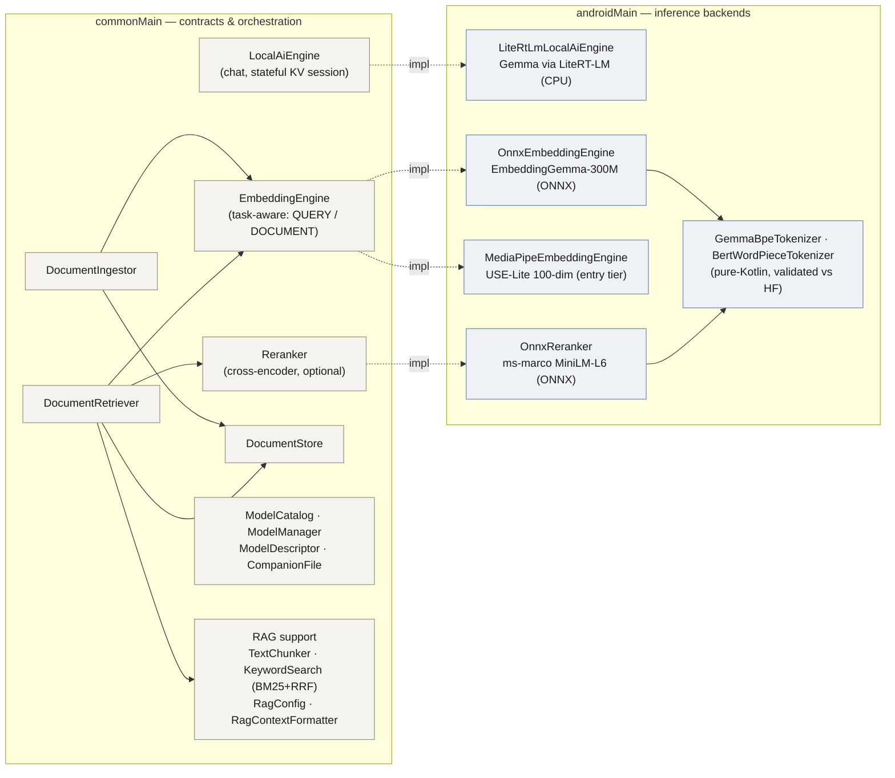
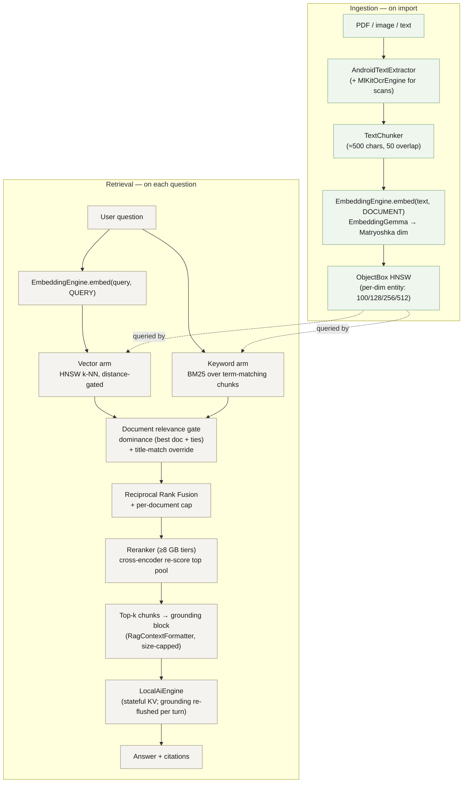
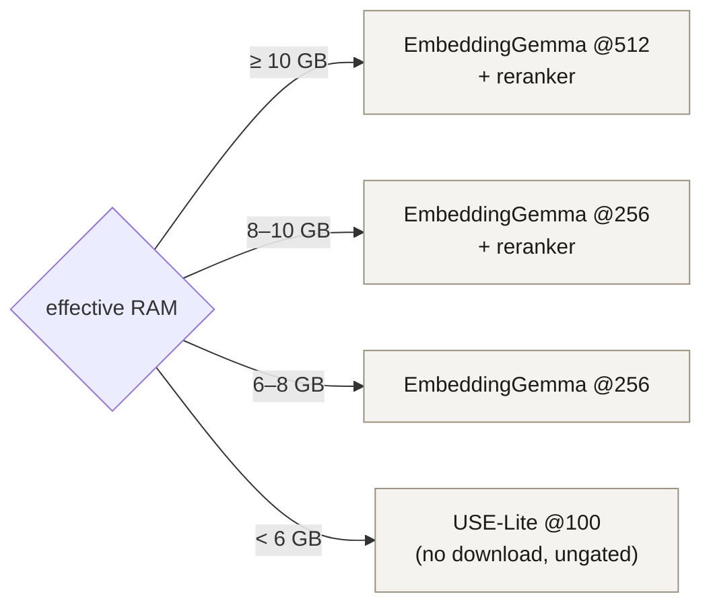

# Architecture

NativeLM is an on-device document-chat app built on **litertlm-kmp**, a Kotlin
Multiplatform engine that wraps Google's LiteRT-LM. Everything — the language model,
the embedder, the vector index, OCR, speech-to-text — runs locally. No account, no
upload, no telemetry. This document explains how the pieces fit together and how the
codebase is organised so the boundary between the reusable **engine** and the
**product** stays clean as it grows.

Two Gradle modules:

- **`:lib`** — the engine (`com.sagar.aicore`). Dual-licensed (AGPL-3.0 / commercial).
  Pure Kotlin Multiplatform: `commonMain` holds platform-neutral contracts and
  orchestration; `androidMain` holds the Android-backed inference implementations;
  `iosMain` carries the iOS roadmap surface.
- **`:sample-app`** — the NativeLM product (`com.nativelm.app`). Android + Compose. It
  supplies the platform-backed stores (ObjectBox, DataStore, SAF, ML Kit OCR) and the
  user-facing experience, and depends on `:lib` — never the other way around.

The key architectural rule: **the product talks to the engine only through contracts**
(`LocalAiEngine`, `EmbeddingEngine`, `DocumentRetriever`, `DocumentStore`, …). The
product *provides* the storage implementations (e.g. `ObjectBoxDocumentRepository`
implements the engine's `DocumentStore`) but never reaches into engine internals. That
inversion is what lets the same engine power a second app (a kids' learning app, Curio)
through a Gradle composite build.

---

## Engine internals (`:lib`)

The engine is organised around small, swappable contracts in `commonMain`, each with an
Android implementation in `androidMain`. Inference backends are deliberately
**telemetry-free**: the LLM runs on LiteRT-LM (CPU), and the embedder/reranker run on
**ONNX Runtime** (Microsoft, no Google/Play dependency) rather than MediaPipe — a
conscious choice to protect the zero-telemetry promise.

Beyond core inference, the engine also hosts: **Studio** (`studio/` — generating
artifacts like mind maps, timelines, podcasts from documents), **Sync** (`sync/` — P2P
device-to-device transfer over NSD/mDNS + TCP, GMS-free), **Backup** (`backup/` —
passphrase-encrypted `.nlmbak` export, Argon2id + AES-256-GCM), and **Chart**
(`chart/`). Speech-to-text (`SpeechToText`) is wired to on-device Whisper in the app.

---

## The RAG pipeline

This is the heart of the product: grounding answers in the user's own documents with
citations. There are two phases — **ingestion** (when a document is imported) and
**retrieval** (when a question is asked).

A few design decisions worth calling out, because they came from real failure modes
(see [`_session/material/blog-embedding-enhancements.md`](../_session/material/blog-embedding-enhancements.md)):

- **Hybrid retrieval.** The vector arm finds semantic matches; the BM25 keyword arm
  recovers exact strings (names, IDs, codenames) that a small embedder ranks poorly. The
  two rankings merge with Reciprocal Rank Fusion.
- **Document relevance gate.** With several similar documents (e.g. a car, a life, and a
  health insurance policy in one project), lexical overlap on words like
  "insurance"/"premium" used to let an answer ground on the *wrong* document. The gate
  keeps only the document(s) the vector arm clearly favours, and a **title-match
  override** lets a query that names a document by its title ("car" → a *CarPolicy*
  source) ground on that document over a higher-scoring but wrong one.
- **Stateful KV, flushed grounding.** The chat session keeps a warm KV cache for flat
  time-to-first-token. But injecting a fresh grounding block every turn would accumulate
  in that cache and eventually overflow the on-device context window — so grounded turns
  re-prefill only the bounded visible transcript, flushing stale grounding.

---

## Device-tiered model selection

On-device inference must fit the phone. `EmbedderRecommendation.forDevice(ramMb)` mirrors
the LLM tiering and picks the embedder, the Matryoshka dimension, and whether to run the
reranker — keyed on effective RAM (after the OEM RAM-expansion cap). One downloaded
EmbeddingGemma model is truncated per tier; entry devices stay on the no-download,
ungated USE-Lite.

The same recommendation surfaces in the Models screen as a *Recommended* badge, and the
download flow pulls the model plus its companions (the ONNX external-data weights blob
and the tokenizer) on-device — gated models reuse the Hugging Face token flow.

---

## Visualising growth

This file is the intentional, reviewed view of the architecture — kept in `docs/` so it
evolves alongside the code (transparent-dev model). For the *organic* view of how the
codebase grew over time, the repository history can be rendered with
[Gource](https://gource.io/) (an animated, file-by-file visualisation of the git log).
See [`docs/gource.md`](gource.md) for the recipe used to produce the growth clip.
